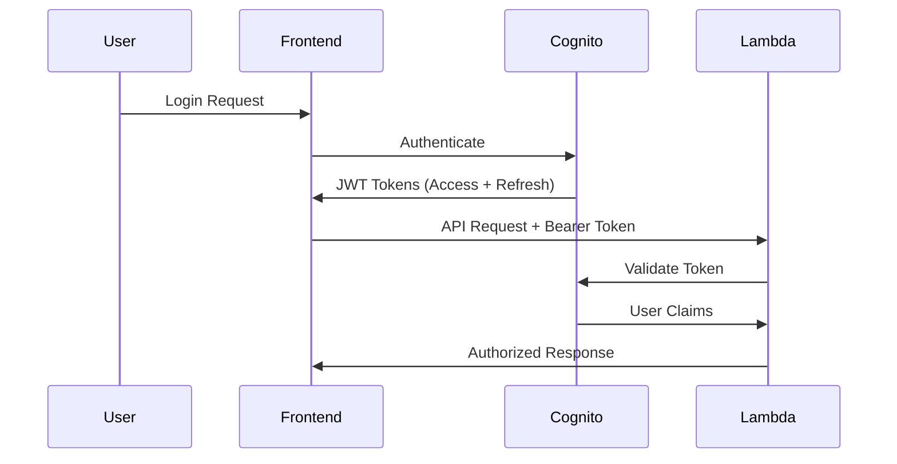

# Audifyy MVP Architecture Documentation

## 🏗️ System Overview

Audifyy is a modern audio content platform that converts web articles into high-quality audio using AI. The system employs a hybrid architecture combining traditional REST APIs with real-time streaming for optimal performance.

### Core Functionality
- **Article Processing**: Extract and clean web content
- **AI Summarization**: Generate audio-optimized summaries using OpenAI GPT
- **Text-to-Speech**: Convert text to natural-sounding audio using OpenAI TTS
- **Streaming Architecture**: Real-time processing with immediate user feedback
- **User Management**: Authentication and personalized content access

---

## 🔄 Streaming Architecture

### Traditional vs Streaming Approach

**❌ Old Blocking Approach:**
```
User Request → [60s wait] → Complete Audio Response
```

**✅ New Streaming Approach:**
```
User Request → Immediate Response → Real-time Audio Chunks → Completion
```

### Pipeline Streaming (Revolutionary Feature)

**Summary Mode - LLM→TTS Pipeline:**
```
Article URL
    ↓
Article Extraction (2-5s)
    ↓
OpenAI LLM Streaming (real-time tokens)
    ↓
Sentence Detection & Buffering
    ↓
OpenAI TTS per sentence (parallel)
    ↓
Audio Chunks → User (real-time)
```

**Full Mode - Traditional Streaming:**
```
Article URL
    ↓
Article Extraction (2-5s)
    ↓
OpenAI TTS Chunked Processing
    ↓
Audio Chunks → User (real-time)
```

---

## 🏢 System Architecture

### Frontend (React + Vite)
- **Framework**: React 18 with TypeScript
- **Build Tool**: Vite for fast development
- **Authentication**: AWS Cognito integration
- **Streaming**: Fetch API with Server-Sent Events (SSE)
- **State Management**: React hooks + context
- **Hosting**: AWS CloudFront + S3

### Backend (FastAPI + Lambda)
- **Framework**: FastAPI with Python 3.11
- **Runtime**: AWS Lambda with Lambda Web Adapter
- **Streaming**: Lambda Function URLs with RESPONSE_STREAM mode
- **APIs**: Hybrid approach (API Gateway + Function URLs)
- **Authentication**: AWS Cognito JWT validation

### Infrastructure (AWS Serverless)
- **Compute**: AWS Lambda with container images
- **Storage**: S3 for audio files with lifecycle policies
- **Database**: DynamoDB for job status and metadata
- **Queue**: SQS for background job processing
- **CDN**: CloudFront for global content delivery
- **DNS**: Route 53 (when custom domain configured)

---

## 🔐 Authentication Flow

### AWS Cognito Integration


### Token Management
- **Access Token**: 1 hour validity, used for API requests
- **Refresh Token**: 30 days validity, automatic renewal
- **ID Token**: User profile information
- **Storage**: Secure browser storage with automatic cleanup

---

## 📡 API Endpoints

### Core Processing Endpoints

#### `POST /api/validate-url`
- **Purpose**: Pre-validate article URLs
- **Auth**: None required
- **Response**: `{valid: boolean, url: string}`

#### `POST /api/process-article-streaming` (Function URL)
- **Purpose**: Real-time streaming processing
- **Auth**: Required (JWT Bearer)
- **Mode**: Streaming response with audio chunks
- **Features**: Pipeline streaming for summary mode

#### `POST /api/process-article` (API Gateway)
- **Purpose**: Background job processing
- **Auth**: Required (JWT Bearer)
- **Response**: `{job_id, status, estimated_time}`

#### `GET /api/job-status/{job_id}`
- **Purpose**: Poll job progress
- **Auth**: Required (JWT Bearer)
- **Response**: Job status with progress updates

### User Content Endpoints

#### `GET /api/my-articles`
- **Purpose**: Paginated user article history
- **Auth**: Required (JWT Bearer)
- **Features**: Fresh presigned URLs, pagination

#### `GET /api/audio/{audio_id}`
- **Purpose**: Stream audio files
- **Auth**: Required (JWT Bearer)
- **Response**: Audio stream or S3 redirect

---

## 🔄 Data Flow

### Summary Mode (Pipeline Streaming)
```
1. User submits article URL
2. Frontend → Function URL (streaming connection)
3. Lambda extracts article content
4. OpenAI LLM streams summary tokens
5. Sentence detection and buffering
6. Per-sentence TTS generation
7. Audio chunks → User in real-time
8. Parallel S3 storage for "Recent Articles"
```

### Full Mode (Traditional Streaming)
```
1. User submits article URL
2. Frontend → Function URL (streaming connection)
3. Lambda extracts full article content
4. OpenAI TTS processes in 4K chunks
5. Audio chunks → User in real-time
6. Complete audio stored in S3
```

### Background Processing (Legacy Support)
```
1. User submits article URL
2. Frontend → API Gateway
3. Lambda → SQS job message
4. Background Lambda processes article
5. Status updates in DynamoDB
6. Frontend polls for completion
```

---

## 🛡️ Error Handling

### Streaming Error Management
- **Connection Errors**: Automatic retry with exponential backoff
- **TTS Failures**: Continue processing remaining sentences
- **Token Expiry**: Refresh tokens automatically
- **Rate Limiting**: Queue requests and inform user

### Error Categories
1. **Client Errors (4xx)**: Invalid URLs, authentication failures
2. **Server Errors (5xx)**: OpenAI API failures, Lambda timeouts
3. **Streaming Errors**: Connection drops, partial responses
4. **Rate Limiting**: OpenAI API rate limits

### Resilience Patterns
- **Circuit Breaker**: Stop processing after multiple failures
- **Graceful Degradation**: Fallback to non-streaming mode
- **Retry Logic**: Exponential backoff for transient failures
- **User Feedback**: Real-time error notifications

---

## ⚡ Performance Optimizations

### Streaming Optimizations
- **Pipeline Streaming**: LLM tokens → TTS immediately
- **Parallel Processing**: Multiple TTS calls for different sentences
- **Lambda Web Adapter**: Native streaming support
- **Function URLs**: Bypass API Gateway latency

### Caching Strategy
- **Content Hashing**: Avoid duplicate TTS processing
- **S3 Storage**: Permanent audio file storage
- **CloudFront**: Global CDN for audio delivery
- **Browser Caching**: Client-side audio caching

### Infrastructure Optimizations
- **Lambda Memory**: 2GB for optimal performance
- **Container Images**: Faster cold starts than ZIP packages
- **Regional Deployment**: Single region for cost efficiency
- **S3 Lifecycle**: Automatic cleanup of old files

---

## 🔧 Development vs Production

### Development Environment
- **Local FastAPI**: `uvicorn app.main:app --reload`
- **Local Frontend**: `npm run dev` on port 5173
- **CORS**: Localhost origins enabled
- **Storage**: Local file system fallback
- **Authentication**: Optional for development

### Production Environment
- **Lambda Deployment**: Container images via ECR
- **CloudFront**: Global CDN with custom domain
- **CORS**: Restricted to production domains
- **Storage**: S3 with IAM security
- **Authentication**: Mandatory Cognito integration

### Environment Variables
```bash
# Core Settings
ENVIRONMENT=dev|staging|prod
OPENAI_API_KEY=sk-...
CORS_ORIGINS=["https://domain.com"]

# AWS Services
AUDIO_BUCKET_NAME=audifyy-audio-dev-xyz
DYNAMODB_TABLE_NAME=audifyy-jobs-dev
SQS_QUEUE_URL=https://sqs.region.amazonaws.com/.../queue
COGNITO_USER_POOL_ID=region_abcd123
COGNITO_CLIENT_ID=abcd123...

# Lambda Web Adapter (Function URL Streaming)
AWS_LWA_ENABLE_COMPRESSION=true
AWS_LWA_INVOKE_MODE=response_stream
PORT=8080
```

---

## 📊 Monitoring & Observability

### Logging Strategy
- **Structured Logging**: JSON format with correlation IDs
- **CloudWatch Logs**: Centralized log aggregation
- **Error Tracking**: Detailed error context and stack traces
- **Performance Metrics**: Processing times and resource usage

### Key Metrics
- **Processing Time**: End-to-end article processing duration
- **Streaming Latency**: Time to first audio chunk
- **Error Rate**: Failed requests by error type
- **Cost Tracking**: OpenAI API usage and AWS costs

### Alerts & Monitoring
- **High Error Rate**: >5% errors trigger alerts
- **Long Processing Time**: >2 minutes for streaming
- **API Rate Limits**: OpenAI quota approaching
- **Infrastructure**: Lambda errors, S3 failures

---

## 🚀 Deployment Strategy

### Infrastructure as Code (Terraform)
- **Modular Design**: Separate modules for each service
- **Environment Management**: Dev/staging/prod configurations
- **State Management**: Remote state in S3 + DynamoDB locking
- **CI/CD Integration**: GitHub Actions automation

### Deployment Pipeline
```
1. Code Push → GitHub
2. GitHub Actions builds container
3. Push to Amazon ECR
4. Terraform applies infrastructure
5. Lambda functions updated automatically
6. Frontend deployed to S3 + CloudFront
```

### Rollback Strategy
- **Blue-Green Deployments**: Zero-downtime updates
- **Lambda Versioning**: Instant rollback capability
- **CloudFront Invalidation**: Cache clearing for updates
- **Database Migrations**: Forward-compatible changes only

---

## 📈 Scalability Considerations

### Current Limits
- **Lambda Concurrency**: 1000 concurrent executions
- **OpenAI Rate Limits**: 10,000 requests/minute
- **S3 Storage**: Unlimited with lifecycle policies
- **DynamoDB**: On-demand scaling

### Future Scaling
- **Multi-Region**: Global deployment for latency
- **CDN Optimization**: Edge caching for audio content
- **Database Sharding**: Partition by user_id if needed
- **Cost Optimization**: Reserved capacity for predictable workloads

---

## 🔒 Security Considerations

### Authentication & Authorization
- **JWT Validation**: Every API request authenticated
- **User Isolation**: S3 keys include user_id prefix
- **CORS Policy**: Restricted origins in production
- **Token Expiry**: Short-lived access tokens

### Data Protection
- **Encryption**: S3 server-side encryption (AES-256)
- **TLS**: All API communications over HTTPS
- **Input Validation**: Sanitize all user inputs
- **Rate Limiting**: Prevent abuse and spam

### Infrastructure Security
- **IAM Roles**: Least privilege access
- **VPC**: Optional network isolation
- **Secrets Management**: AWS Systems Manager Parameter Store
- **Audit Logging**: CloudTrail for all AWS API calls

---

## 🛠️ Development Guidelines

### Code Structure
```
backend/
├── app/
│   ├── api/routes/          # API endpoint handlers
│   ├── services/            # Business logic (LLM, TTS, etc.)
│   ├── core/               # Configuration and settings
│   ├── auth/               # Authentication utilities
│   └── models/             # Pydantic models
├── requirements.txt        # Python dependencies
└── Dockerfile             # Lambda container image

frontend/
├── src/
│   ├── components/        # React components
│   ├── services/          # API client and utilities
│   ├── hooks/            # Custom React hooks
│   └── types/            # TypeScript definitions
├── public/               # Static assets
└── package.json         # Node.js dependencies

infra/
└── terraform/           # Infrastructure as Code
    ├── backend.tf      # Lambda, API Gateway, DynamoDB
    ├── frontend.tf     # S3, CloudFront, Route 53
    └── variables.tf    # Configuration parameters
```

### Best Practices
- **Type Safety**: TypeScript everywhere
- **Error Handling**: Comprehensive try-catch blocks
- **Testing**: Unit tests for critical functions
- **Documentation**: Inline code comments
- **Code Review**: Pull request reviews required

---

## 📚 Technology Stack Summary

### Frontend
- **React 18** + **TypeScript** + **Vite**
- **AWS Cognito** for authentication
- **Fetch API** for streaming
- **CSS Modules** for styling

### Backend
- **FastAPI** + **Python 3.11** + **Pydantic**
- **LangChain** for OpenAI integration
- **Boto3** for AWS services
- **Lambda Web Adapter** for streaming

### Infrastructure
- **AWS Lambda** (compute)
- **Amazon S3** (storage)
- **DynamoDB** (database)
- **SQS** (messaging)
- **CloudFront** (CDN)
- **Cognito** (auth)

### External APIs
- **OpenAI GPT-3.5-turbo** (summarization)
- **OpenAI TTS-1** (text-to-speech)
- **Web scraping** (article extraction)

---

This architecture provides a scalable, performant, and cost-effective solution for converting articles to audio with real-time streaming capabilities.